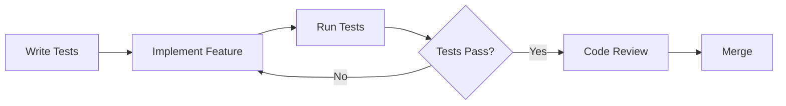

# RiceMillOS Development Best Practices

## 🧪 Testing Strategy & TDD

### Test-Driven Development (TDD) Approach

1. **Red-Green-Refactor Cycle**
   ```
   RED: Write failing test first
   GREEN: Write minimal code to pass
   REFACTOR: Improve code while keeping tests green
   ```

2. **Testing Pyramid**
   ```
   E2E Tests (Few)      🔺
   Integration Tests    🔷🔷
   Unit Tests (Many)    🟦🟦🟦🟦
   ```

### Testing Standards

- **Coverage Target**: Minimum 70% for all metrics
- **Test Categories**:
  - Unit tests for utilities, hooks, and components
  - Integration tests for user flows
  - E2E tests for critical business processes

### Testing Commands
```bash
# Run all tests
npm test

# Watch mode for development
npm run test:watch

# Coverage report
npm run test:coverage

# CI mode
npm run test:ci
```

## 🏗️ Architecture Patterns

### Component Architecture

1. **Atomic Design Pattern**
   ```
   Atoms → Buttons, Inputs, Icons
   Molecules → SearchBox, FormField
   Organisms → FarmerList, Dashboard
   Templates → PageLayout
   Pages → Specific page implementations
   ```

2. **Container/Presenter Pattern**
   ```typescript
   // Container (Smart Component)
   const FarmerListContainer = () => {
     const { farmers, loading, error } = useFarmers();
     return <FarmerList farmers={farmers} loading={loading} />;
   };

   // Presenter (Dumb Component)
   const FarmerList = ({ farmers, loading }) => {
     // Only UI logic, no data fetching
   };
   ```

### State Management

1. **Local State**: useState, useReducer for component state
2. **Server State**: React Query for API data
3. **Global State**: Zustand for app-wide state
4. **Auth State**: Custom AuthContext

### Folder Structure
```
src/
├── components/           # Reusable UI components
│   ├── ui/              # Basic UI components (atoms)
│   ├── forms/           # Form components
│   └── layout/          # Layout components
├── hooks/               # Custom React hooks
├── lib/                 # Utility libraries
├── services/            # API services
├── types/               # TypeScript types
├── utils/               # Helper functions
├── contexts/            # React contexts
└── test/                # Test utilities
```

## 🔄 Development Workflow

### 1. Feature Development Process



### 2. Git Workflow

#### Branch Naming Convention
```
feature/auth-system
bugfix/farmer-search-issue
hotfix/critical-security-patch
chore/update-dependencies
```

#### Commit Message Format
```
type(scope): description

feat(farmers): add farmer search functionality
fix(auth): resolve login redirect issue
test(components): add FarmerList component tests
docs(readme): update installation instructions
```

### 3. Code Review Checklist

- [ ] Tests are written and passing
- [ ] Code follows TypeScript best practices
- [ ] Components are accessible (ARIA labels, keyboard navigation)
- [ ] Mobile responsive design
- [ ] Error handling implemented
- [ ] Loading states included
- [ ] Performance considerations
- [ ] Security considerations (input validation, XSS prevention)

## 📊 Performance Best Practices

### 1. React Performance

```typescript
// Use React.memo for expensive components
const ExpensiveFarmerCard = React.memo(({ farmer }) => {
  return <div>...</div>;
});

// Use useMemo for expensive calculations
const filteredFarmers = useMemo(() => {
  return farmers.filter(farmer => 
    farmer.name.includes(searchTerm)
  );
}, [farmers, searchTerm]);

// Use useCallback for stable function references
const handleFarmerEdit = useCallback((farmer) => {
  // Handle edit
}, []);
```

### 2. Bundle Optimization

```typescript
// Dynamic imports for code splitting
const FarmerReports = lazy(() => import('./FarmerReports'));

// Tree shaking - import only what you need
import { format } from 'date-fns/format';
// Instead of: import { format } from 'date-fns';
```

### 3. Data Loading Patterns

```typescript
// Optimistic updates
const { mutate } = useMutation(updateFarmer, {
  onMutate: async (newFarmer) => {
    // Optimistically update the UI
    queryClient.setQueryData(['farmers'], old => 
      old.map(f => f.id === newFarmer.id ? newFarmer : f)
    );
  },
});

// Pagination for large datasets
const { data, fetchNextPage } = useInfiniteQuery(
  ['farmers'],
  ({ pageParam = 0 }) => fetchFarmers(pageParam)
);
```

## 🔒 Security Best Practices

### 1. Input Validation

```typescript
// Use Zod for runtime validation
const farmerSchema = z.object({
  name: z.string().min(1).max(100),
  phone: z.string().regex(/^\+91-\d{10}$/),
  email: z.string().email().optional(),
});

// Validate on both client and server
const validateFarmer = (data: unknown) => {
  return farmerSchema.parse(data);
};
```

### 2. XSS Prevention

```typescript
// Use dangerouslySetInnerHTML sparingly
const sanitizeHtml = (html: string) => {
  return DOMPurify.sanitize(html);
};

// Prefer text content over HTML
<div>{farmer.name}</div> // Safe
// Instead of: <div dangerouslySetInnerHTML={{__html: farmer.name}} />
```

### 3. Authentication Security

```typescript
// Always validate tokens server-side
const validateSession = async (token: string) => {
  const { data, error } = await supabase.auth.getUser(token);
  if (error) throw new Error('Invalid session');
  return data.user;
};

// Use proper HTTPS in production
// Configure CSP headers
// Implement rate limiting
```

## 📱 Mobile & Accessibility

### 1. Mobile-First Design

```css
/* Start with mobile styles */
.farmer-card {
  padding: 1rem;
}

/* Scale up for larger screens */
@media (min-width: 768px) {
  .farmer-card {
    padding: 1.5rem;
  }
}
```

### 2. Accessibility Standards

```typescript
// Proper ARIA labels
<button 
  aria-label={`Edit farmer ${farmer.name}`}
  onClick={() => onEdit(farmer)}
>
  <Edit className="h-4 w-4" />
</button>

// Keyboard navigation
const handleKeyDown = (e: KeyboardEvent) => {
  if (e.key === 'Enter' || e.key === ' ') {
    handleClick();
  }
};

// Focus management
useEffect(() => {
  if (isModalOpen) {
    focusFirstElement();
  }
}, [isModalOpen]);
```

### 3. Progressive Web App (PWA)

```typescript
// Service Worker for offline support
if ('serviceWorker' in navigator) {
  navigator.serviceWorker.register('/sw.js');
}

// Cache critical data
const useOfflineData = () => {
  const [offlineData, setOfflineData] = useState(null);
  
  useEffect(() => {
    // Load from IndexedDB when offline
    if (!navigator.onLine) {
      loadOfflineData().then(setOfflineData);
    }
  }, []);
};
```

## 🧩 Code Quality Tools

### 1. ESLint Configuration

```json
{
  "extends": [
    "next/core-web-vitals",
    "@typescript-eslint/recommended",
    "prettier"
  ],
  "rules": {
    "@typescript-eslint/no-unused-vars": "error",
    "prefer-const": "error",
    "no-var": "error"
  }
}
```

### 2. Prettier Configuration

```json
{
  "semi": true,
  "trailingComma": "es5",
  "singleQuote": true,
  "printWidth": 100,
  "tabWidth": 2
}
```

### 3. Husky Pre-commit Hooks

```json
{
  "husky": {
    "hooks": {
      "pre-commit": "lint-staged",
      "pre-push": "npm run test:ci"
    }
  },
  "lint-staged": {
    "*.{ts,tsx}": ["eslint --fix", "prettier --write", "git add"],
    "*.{json,md}": ["prettier --write", "git add"]
  }
}
```

## 📈 Monitoring & Error Tracking

### 1. Error Boundaries

```typescript
class ErrorBoundary extends React.Component {
  constructor(props) {
    super(props);
    this.state = { hasError: false };
  }

  static getDerivedStateFromError(error) {
    return { hasError: true };
  }

  componentDidCatch(error, errorInfo) {
    // Log to error tracking service
    logErrorToService(error, errorInfo);
  }

  render() {
    if (this.state.hasError) {
      return <ErrorFallback />;
    }
    return this.props.children;
  }
}
```

### 2. Performance Monitoring

```typescript
// Core Web Vitals tracking
import { getCLS, getFID, getFCP, getLCP, getTTFB } from 'web-vitals';

getCLS(console.log);
getFID(console.log);
getFCP(console.log);
getLCP(console.log);
getTTFB(console.log);
```

## 🚀 Deployment & CI/CD

### 1. Environment Management

```env
# .env.local
NEXT_PUBLIC_SUPABASE_URL=http://localhost:54321
NEXT_PUBLIC_ENV=development

# .env.production
NEXT_PUBLIC_SUPABASE_URL=https://your-project.supabase.co
NEXT_PUBLIC_ENV=production
```

### 2. Docker Best Practices

```dockerfile
# Multi-stage build for production
FROM node:18-alpine AS deps
WORKDIR /app
COPY package*.json ./
RUN npm ci --only=production

FROM node:18-alpine AS builder
WORKDIR /app
COPY . .
RUN npm run build

FROM node:18-alpine AS runner
WORKDIR /app
COPY --from=builder /app/.next ./.next
COPY --from=deps /app/node_modules ./node_modules
EXPOSE 3000
CMD ["npm", "start"]
```

### 3. CI/CD Pipeline

```yaml
# .github/workflows/ci.yml
name: CI/CD
on: [push, pull_request]

jobs:
  test:
    runs-on: ubuntu-latest
    steps:
      - uses: actions/checkout@v3
      - uses: actions/setup-node@v3
      - run: npm ci
      - run: npm run test:ci
      - run: npm run build
      - run: npm run type-check
```

## 📋 Additional Recommendations

### 1. Alternative Development Approaches

1. **Behavior-Driven Development (BDD)**
   - Use Cucumber or similar for business-readable tests
   - Write scenarios in Gherkin syntax
   - Focus on user behavior rather than implementation

2. **Domain-Driven Design (DDD)**
   - Organize code around business domains
   - Use ubiquitous language
   - Implement bounded contexts

3. **Clean Architecture**
   - Separate business logic from frameworks
   - Dependency inversion principle
   - Testable and maintainable code

### 2. Performance Monitoring Tools

- **Lighthouse**: Core Web Vitals and performance audits
- **React DevTools Profiler**: Component performance analysis
- **Bundle Analyzer**: Bundle size optimization
- **Sentry**: Error tracking and performance monitoring

### 3. Development Tools

- **Storybook**: Component development and documentation
- **Chromatic**: Visual regression testing
- **Playwright**: End-to-end testing
- **MSW**: API mocking for development and testing

### 4. Code Documentation

```typescript
/**
 * Fetches farmers from the API with optional filtering
 * @param millId - The mill ID to filter farmers
 * @param searchTerm - Optional search term for farmer names
 * @returns Promise resolving to array of farmers
 * @throws {Error} When API request fails
 * @example
 * ```typescript
 * const farmers = await fetchFarmers('mill-123', 'john');
 * ```
 */
export async function fetchFarmers(
  millId: string, 
  searchTerm?: string
): Promise<Farmer[]> {
  // Implementation
}
```

This comprehensive approach ensures high-quality, maintainable, and scalable code while following industry best practices for a production-ready rice mill management system.